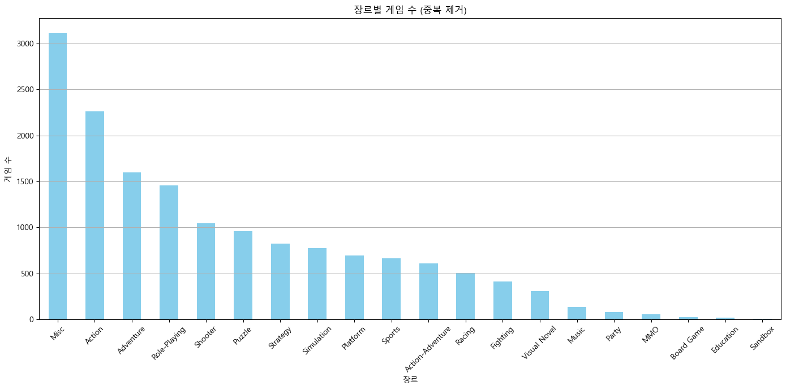

# 신규 게임 개발을 위한 게임 트렌드 분석

## 1. 개요

현재 000회사는 신규 게임 개발을 위한 초기 단계에 있습니다. 그러나 회사 규모가 크지 않아 고비용의 장기간 게임 개발은 어려운 상황입니다. 이에 따라, 우리는 중단기적 성공을 목표로 하는 게임 개발을 계획하고 있습니다.

가성비적 개발을 통해 시장에서 경쟁력을 갖추고자 하며, 이를 위해 현재 시장에서 어떤 장르와 요소가 주목받고 있는지를 파악하는 전체적인 트렌드 분석을 실시하고자 합니다. 이 분석을 통해 보다 나은 의사 결정을 내리기 위한 기초 자료를 마련하는 것이 목표입니다.


## 1-1 선결론

| 장르         | 지역    | 퀄리티 | 비고                                                                                     |
|--------------|---------|--------|------------------------------------------------------------------------------------------|
| 슈팅         | 글로벌  | A      | 판매량이 감소하고 있는 상황을 감안하여, 트리플A 대신 A급 가성비 개발을 통한 시장 진출 전략을 채택합니다. |
| 비주얼 노벨  | 일본    | A      | 일본 내에서 효과적인 판매 가능성이 있지만, 일본 시장의 크기에서 매력적이지 않기 때문에 가성비 개발이 필요합니다. |
| 보드게임     | 글로벌  | B      | 하락 추세의 게임으로, 한정적으로 유럽/아프리카 시장에 진입할 가능성이 있습니다.    |
| 스포츠       | 글로벌  | AA    | 독점 효과를 누릴 수 있는 스포츠 프랜차이즈가 필요하지만, 실제 스포츠 게임 개발은 어려움이 예상됩니다. 판타지적, 전략적 요소를 가진 게임 개발이 유효할 것입니다. |
| 교육/샌드박스| 글로벌  | AA     | 샌드박스 특성상 고퀄리티 게임 제작은 어렵지만, 트렌드의 영향으로 어느 정도 결과물을 기대할 수 있습니다. |


## 2. 데이터 셋

Data_set : https://www.kaggle.com/datasets/asaniczka/video-game-sales-2024

| 컬럼명          | 설명                                                 | 데이터 타입  | 데이터 유형  |
|-----------------|------------------------------------------------------|---------------|---------------|
| img             | vgchartz.com의 박스 아트 URI                        | str           | 명목형        |
| title           | 게임 제목                                            | str           | 명목형        |
| console         | 게임이 출시된 콘솔                                   | str           | 명목형        |
| genre           | 게임의 장르                                         | str           | 명목형        |
| publisher       | 게임의 퍼블리셔                                     | str           | 명목형        |
| developer       | 게임의 개발자                                       | str           | 명목형        |
| critic_score    | 메타크리틱 점수 (10점 만점)                         | float         | 실수형        |
| total_sales     | 전 세계 판매량 (백만 단위)                          | float         | 실수형        |
| na_sales        | 북미 판매량 (백만 단위)                             | float         | 실수형        |
| jp_sales        | 일본 판매량 (백만 단위)                             | float         | 실수형        |
| pal_sales       | 유럽/아프리카 판매량 (백만 단위)                   | float         | 실수형        |
| other_sales     | 기타 판매량 (백만 단위)                             | float         | 실수형        |
| release_date    | 게임 출시 날짜                                      | datetime      | 날짜형       |
| last_update     | 데이터가 마지막으로 업데이트된 날짜                 | datetime      | 날짜형       |


## 3. 분석 전략

- 본 분석의 목표는 트렌드 분석입니다. 기울기를 이용한 시계열 트렌드 분석을 통해 시장에서 유효한 트렌드를 발견하고자 합니다.
- 부가적으로 지역, 장르, 퍼블리셔별 세부 분석을 진행합니다.

## 4. 분석 결과


- 판매량 데이터는 누적 데이터로, 일반적으로 게임이 출시된 지 오래될수록 판매량이 높은 우하향 그래프를 보입니다. 그러나 2010년 전까지는 우상향하는 그래프를 나타내고 있습니다. 이는 게임 개발 기술의 발전과 인터넷 보급 등으로 인해 게임 시장이 활성화된 시기로 해석할 수 있습니다.
- 연도별 발매 수와 판매량의 그래프가 유사하다는 점에서, 발매 수의 차이가 판매량에 큰 영향을 미친다는 것을 알 수 있습니다. 즉, 게임의 판매는 발매 연도를 기준으로 시간이 지남에 따라 급격히 하락하는 경향이 있습니다.
- 따라서 분석의 일관성과 신뢰도를 높이기 위해 2010년 이후의 데이터를 사용하여 분석을 진행합니다.


- 전체적인 판매량이 낮아지고 있음을 확인할 수 있습니다. 또한, 2019년부터 판매량 데이터가 명확하지 않다는 점도 확인되었습니다. 따라서, 전체 기울기 그래프와 2021년까지의 기울기 그래프를 비교 분석하겠습니다.


- 전체 기간 동안 판매량이 감소하고 있는 것을 보여주고 있습니다. 한편, 2021년까지의 데이터를 보면 북미 지역만이 판매량 기울기의 추세가 상승하고 있습니다.

```
이는 전 세계적으로 판매량이 감소하고 있음을 의미합니다. 특히 유럽/아프리카 지역에서 이 현상이 두드러집니다. 
다만 북미 지역에서는 판매량이 낮아지는 추세지만 회복세의 기울기로, 변곡점을 향하고 있다고 해석할 수 있습니다.
```


- 슈팅 게임과 액션 게임이 주를 이루고 있음을 확인했습니다.
- 트렌드 분석 결과, 배틀필드와 피파와 같은 넘버링이 낮은 제품이 상위에 위치하고 있으며, 이는 최신작의 제품 판매도가 떨어지고 있음을 나타냅니다.
- GTA5, RDR2, 콜 오브 듀티 시리즈 등 비교 시, 성공한 시리즈의 다작이 더 효과적이라는 것을 확인했습니다.


- 마인크래프트와 같은 샌드박스 게임들의 크리틱 스코어가 높은 것을 확인했습니다.
- 판매량 순위에서 확인할 수 없었던 비주얼 노벨의 크리틱 스코어가 매우 높다는 점도 주목할 만합니다. 이는 매니악한 경우 후한 점수를 받는 경향이 있어, 적은 생산량과 스토리 중심, 아트 요소가 문학작품처럼 접근할 수 있는 이유로 추측됩니다.


- 판매량이 가장 높은 장르는 슈팅, 액션, 스포츠 순이며, 이들 장르는 크리틱 스코어에서 중간 이하에 위치하고 있습니다.
- 가설:
    - 상위 판매 장르의 게임 수가 많아 하향 평준화가 되었을 가능성이 있습니다.
    - 크리틱 점수는 낮지만 장르적 선호로 인해 판매량이 지지받는 경우도 있을 것입니다.





```
총 판매량이 많은 액션 게임의 경우 하향 평준화가 되었을 가능성이 있습니다. 
슈팅/스포츠 장르의 경우 액션 게임에 비해 절반 수준의 발매수 이므로, 장르적 특수성에 의해 판매량이 지지받을 가능성이 있습니다.
발매수 대비 판매량이 높은 장르로는 스포츠,슈팅,액션,레이싱,샌드박스 순이었습니다.
```

<!--  -->

```
지역별 장르 선호도에서 유의미한 값들을 확인할 수 있습니다.

1. 일본 지역에서는 비주얼 노벨의 선호도가 매우 높습니다.
2. 유럽 지역에서는 보드게임의 선호도가 높은 것을 확인했습니다.
3. 북미 지역에서는 교육 게임의 선호도가 높은데, 이는 마인크래프트의 영향일 것으로 예상됩니다.
```
- 추가 분석을 위해 장르/판매 추세선을 확인하겠습니다.


```
액션 어드벤처뿐만 아니라 각 지역에서 선호하는 게임 장르의 추세선이 우상향하는 것을 확인했습니다. 
다만 비주얼 노벨의 경우 하락하고 있으나 그 기울기가 크지 않아 무시할 수 있을 것으로 예상됩니다.
```


```
판매량 추세의 경우 2021년까지의 데이터를 확인하면 샌드박스와 보드게임이 상승 추세임을 확인했습니다. 이를 통해 유럽 시장에서 게임 파이는 작아지고 있지만 보드게임의 판매량은 높아지는 것을 보아, 주류 게임이 점점 보드게임으로 전환되고 있음을 알 수 있습니다.
```


```
기타 다른 유망했던 장르들의 기울기는 생각보다 크게 나타나고 있으며, 슈팅 게임의 경우 그 하락세가 매우 두드러집니다. 
따라서 개발 대비 좋은 판매량을 획득할 가능성이 적을 것으로 예상됩니다.
```

### 수치형 관계도 확인

```
크리틱 스코어와 판매량의 상관관계에서 대부분이 정방향 상관관계를 이루고 있습니다. 
단, 일본 판매의 경우 크리틱 스코어와 다른 지역과의 선호도에서 많은 차이를 보이고 있어, 일본 시장은 매니악 시장이라고 판단됩니다.
```


## 5. 기타 분석


- 퍼블리셔 별 판매량에 유의미한 상관관계가 있는지 통계 검정을 실시했습니다.

| 항목                | 값                             |
|---------------------|--------------------------------|
| F-statistic         | 3.7809981359259193             |
| p-value             | 1.2433878416240428e-117        |
| 유의미성            | 퍼블리셔 간에 판매량의 차이가 유의미합니다. |


```
통계적 검정에 의해 판매량에 대한 퍼블리셔의 영향력은 유의미한 것을 확인했습니다. 
따라서, 자본이 된다면 유명 퍼블리셔가 참여하는 것이 더욱 긍정적일 것입니다.
```

## 6. 결론
```
1.종합 
게임은 발매 후 판매량이 급격하게 하락하여 소위 '오픈런'이 매우 중요합니다. 
최근 전 세계적으로 판매량이 떨어지고 있어 게임 시장은 박리 다매의 전략이 점점 어려워질 수 있습니다.
판매량의 경우 하나의 대표적 게임의 시리즈가 계속해서 판매되는 것을 확인할 수 있으며, 이는 위의 박리 다매 전략에 대한 분석과 일맥상통하는 결과입니다.

2. 지역별
북미 지역에서는 하락세가 줄어들어 변곡점을 향하고 있는 추세이며, 상승 가능성이 있습니다. 
일본은 타 지역과 다르게 매니악한 판매량을 보이고 있습니다. 
유럽/아프리카 지역은 게임의 판매량이 줄어들고 있습니다.

3. 장르별
슈팅/스포츠의 경우 대체 게임이 없어 장르적 특수성에 의해 판매량을 지지할 가능성이 있습니다. 
단, 슈팅의 경우 판매량의 추세가 매우 급하게 하락하고 있는 추세입니다. 
비주얼 노벨의 경우 판매량은 낮으나 크리틱 스코어가 매우 높아 일본 한정으로 매니아들을 모집하여 충성 고객화 가능성이 있습니다. 
보드게임의 경우 유럽/아프리카에서 게임 내 비율의 상승을 보이고 있어 한정적 시장에 유효할 것으로 예상됩니다.

4. 기타
통계적 검정에 의하면 유명 퍼블리셔가 참여하는 것이 판매량에 더욱 긍정적인 효과를 주고 있습니다.
```


| 장르         | 지역    | 퀄리티 | 비고                                                                                     |
|--------------|---------|--------|------------------------------------------------------------------------------------------|
| 슈팅         | 글로벌  | A      | 판매량이 감소하고 있는 상황을 감안하여, 트리플A 대신 A급 가성비 개발을 통한 시장 진출 전략을 채택합니다. |
| 비주얼 노벨  | 일본    | A      | 일본 내에서 효과적인 판매 가능성이 있지만, 일본 시장의 크기에서 매력적이지 않기 때문에 가성비 개발이 필요합니다. |
| 보드게임     | 글로벌  | B      | 하락 추세의 게임으로, 한정적으로 유럽/아프리카 시장에 진입할 가능성이 있습니다.    |
| 스포츠       | 글로벌  | AA    | 독점 효과를 누릴 수 있는 스포츠 프랜차이즈가 필요하지만, 실제 스포츠 게임 개발은 어려움이 예상됩니다. 판타지적, 전략적 요소를 가진 게임 개발이 유효할 것입니다. |
| 교육/샌드박스| 글로벌  | AA     | 샌드박스 특성상 고퀄리티 게임 제작은 어렵지만, 트렌드의 영향으로 어느 정도 결과물을 기대할 수 있습니다. |
